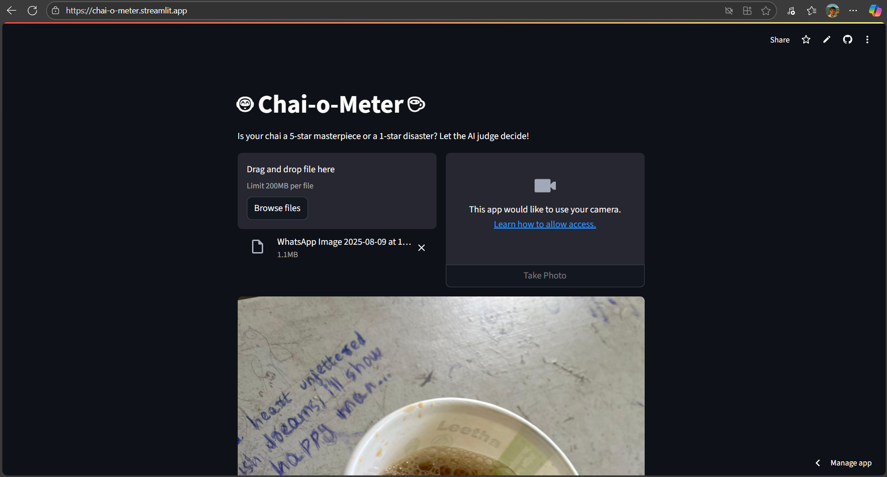
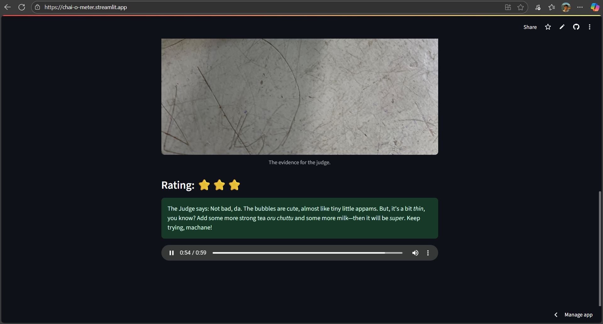
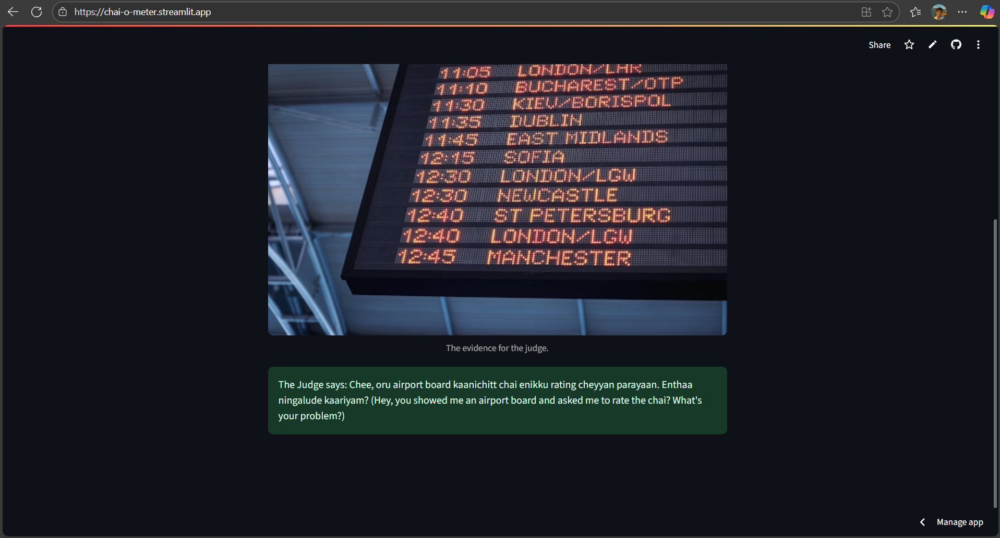

# Chai-O-Meter 🎯


## Basic Details
### Team Name: Crazz


### Team Members
- Team Lead: Nandith N - Vidya Academy of Science and Technology
- Member 2: Arohan AR - Vidya Academy of Science and Technology

### Project Description
Ever wonder if your chai is truly up to snuff? The Chai-o-meter is a web app that uses AI to analyze your tea and deliver a brutally honest, sarcastic critique. It's the ultimate judge for discerning drinkers, ready to shame a lackluster brew or offer a rare moment of praise.

### The Problem (that doesn't exist)
In the absence of a brutally honest tea connoisseur, how can individuals get instant, entertaining, and critical feedback on the quality of their brew?

### The Solution (that nobody asked for)
The Solution (that nobody asked for)
We're solving this crucial, world-changing problem by forcing a powerful AI to become your personal, brutally honest tea critic. Our AI-powered web app takes a photo of your tea and, in return, delivers a witty, sarcastic verdict. Think of it as the digital sommelier you never knew you needed and probably never wanted.

## Technical Details
### Technologies/Components Used
For Software:
- **Languages used:** Python
- **Frameworks used:** Streamlit
- **Libraries used:**
  - `google-generativeai` (for Gemini API interaction)
  - `Pillow` (for image processing)
  - `opencv-python-headless` (for camera feed processing)
  - `python-dotenv` (for environment variable management)
- **Tools used:** Git, GitHub, VS Code

For Hardware:
- This is a software-only project. The only hardware required is a computer with a webcam.

### Implementation
For Software:

# Installation
1. Clone the repository.
   ```bash
   git clone <your-repo-url>
   ```
2. Navigate to the project directory.
   ```bash
   cd <project-directory>
   ```
3. Install the required dependencies.
   ```bash
   pip install -r requirements.txt
   ```
4. Create a `.env` file in the root directory and add your Gemini API key.
   ```
   GEMINI_API_KEY=YOUR_API_KEY
   ```

# Run
To run the web application, use the following command:
```bash
streamlit run app.py
```

### Project Documentation
For Software:

# Screenshots (Add at least 3)

*Caption: The main interface of the application, showing the file upload and camera input options.*


*Caption: A 5-star chai being judged by the AI, with a funny, complimentary comment.*


*Caption: A non-chai image (e.g., a cup of coffee) getting a 0-star rating and a sarcastic roast.*
---
Made with ❤️ at TinkerHub Useless Projects 

[](https://www.tinkerhub.org/)
[](https://www.tinkerhub.org/events/Q2Q1TQKX6Q/Useless%20Projects)
